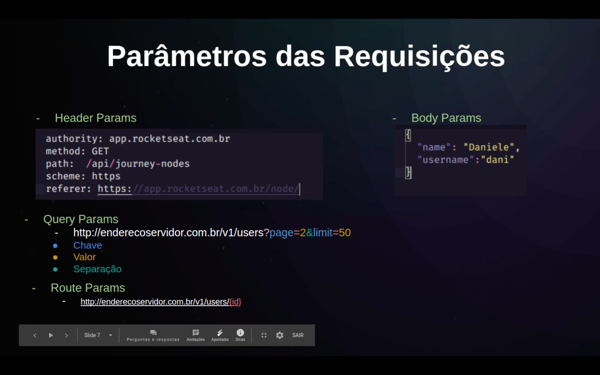
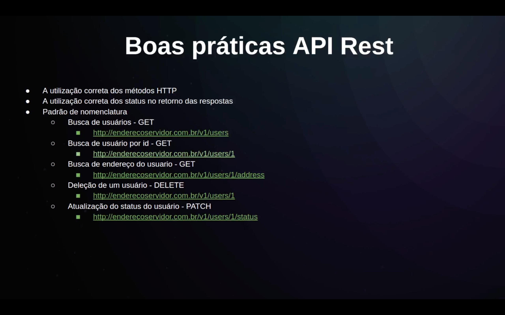

# Ignite Node 01 - 2022: Fundamentos do Node JS 
## Introdução 
### O que é Node Js 
- Plataforma open-sorce que permite execução da linguagem Javascript do lado do servidor
- V8 + libuv + conjunto de módulos
- O node veio resolver que as tecnologias da época não davam suporte ao processo de I/O

### Características do Node Js 
- Arquitetura Event Loop: baseado em eventos 
    - Call Stack: pilhas de funções que vão ser chamadas
- Single Thread 
- Non-blocking I/O : Não precisa que a primeira função seja executada para que outra seja feita 
- Módulos ppróprios: http, fs, dns, buffer, etc

### O que são gerenciadores de pacotes? 
- Instalar bibliotecas 
- NPM e Yarn 
- Disponibilizar bibliotecas 

### Frameworks
- Express
- Egg,js
- Nest.js
- Adonis.js

## API Rest
### O que é API
- Application Programming Interface (Interface de Programação de aplicativos)
- Conjunto de especificações, requisitos de possíveis interações entre aplicações, em como um aplicativo vai se comunicar com o outro. 
- É super importanteter uma documentação para o desenvolvedor 
- Quais são as rotas que você vai poder utilizar, quais são os parâmetros que você pode enviar, quais são os tipos de retorno que você pode ter ao chamar uma aplicação

### O que é REST? 
- Representation State Transfer (Transferência Representacionalde Estado)
- Modelo de arquitetura
- 6 Regras
  - 1. Cliente - Server: Separar as responsabilidades. O Cliente nao necessariamente precisa ser um front-end, pode ser um back-end consumindo outro back-end. O cliente não precisa conhecer e se preocupar o que está sendo implementado no server e da mesma forma o server não precisa conhecer e se preocupar com o que está acontecendo com o lado do cliente.
  - 2. Stateless: O cliente pode requisitar quantas requisições para o servidor,  porém o servidor não armazena nenhum estado ou sessão do servidor  
  - 3. Cache: Nossa construcao pode ser criada com cache, mas nao precisamos que ele comece com o cache
  - 4. Interface Uniforme: Como o cliente e o servidor vão compartilhar essa interface. Como se fosse um contrato 
    - htttp://enderecosservidor.com.br/products
    - https:// enderecoservidor.com.br/clients
    -  Representação dos recursos: servidor pode entregar as solicitações da forma json, xml, html
    -  Mensagens auto-descritivas: retornar de uma forma que a gente saiba o que aconteceu 
    -  HATEOAS(Hypertext as the engine of application state): retornar links dentro da nossa requisição 
    ```js
    {
        "id":1, 
        "user": "danieleleao",
        "create_at": "2020-10-10",
        "commentsLinks: "api/user/1/comments", 
    }
    ```
    - 5. Camadas 
    - 6. Código sob demandas


## Métodos de Requisições 
### HTTP Verbs 
- GET: Leitura 
- POST: Criação 
- PUT: Autualização 
- DELETE: Deleção 
- PATCH: Atualização parcial 

### HTTP Codes
- 1xx: Informativo 
- 2xx: Confirmação 
    - 200: Requisição bem sucedida 
    - 201: Created: Geralmente usado no POST após uma inserção 
- 3xx: Redirecionamento 
    - 301: Moved Permanently 
    - 302: Moved 
- 4xx: Erro do cliente 
]   - 400: Bad Request
    - 401: Unathourized 
    - 403: Forbidden 
    - 404: Not Found 
    - 422: unprocessable Entry
- 5xx : Erro no servidor - o servidor falhou no concluir a solicitação
    - 500: Interval Server Error 
    - 502: Bad Gateway 






## Configurando o projeto v1 
1 - `yarn init -y `

2 - package json: onde vamos armazenar todas as dependências dos nossos projetos. Exemplo: gerenciar as nossas rotas, script de desenvolvimento, etc. 

3 - `yarn add express`

4 - `node src/index.js`

5 - request é tudo aquilo que a gente está recebendo da nossa requisição e response é tudo aquilo que vai retornar na nossa requisição. 

6 - 
```js
const express = require('express'); 
const app = express();

app.get('/', (request, response) => { 
    return response.json({message: "Hello World Ignite!"}); 
})

app.listen(3333); 
```

7 - `yarn add nodemon -D`

8 - 
```
    GET: Buscar uma informação dentro do servidor 
    POST: Inserir uma informação no servidor 
    PUT: Alterar uma informação no servidor 
    PATCH: Alterar uma informação específica
    DELETE: Deletar uma informação no servidor 
```

## Tipos de parâmetros
1 - Route Params => encapsulados na nossa rota. Exemplo o "id".
`"/coursers/:id"`: Identificar um recurso, editar, buscar e/ou deletar. 

2 - Query Params => Paginação, filtro 

3 - Body Params => Os objetos para inserção / alteração de algum recurso (JSON)# ignite-node-01-fundamentos
